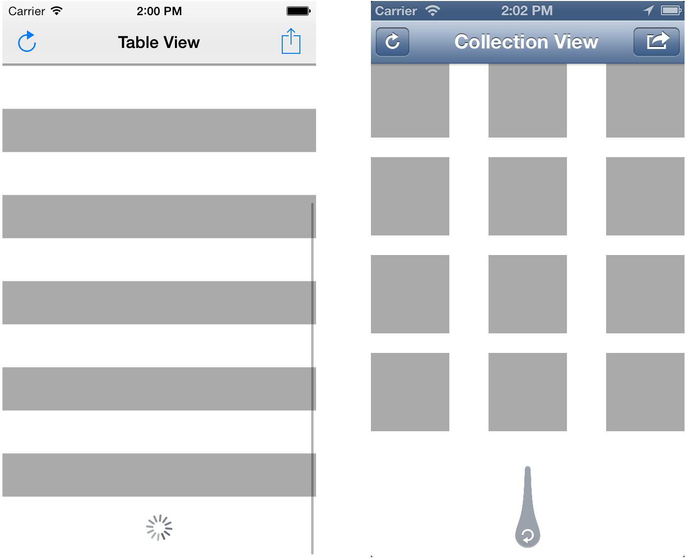

CCBottomRefreshControl
======================

Category for `UIScrollView` class, that adds `bottomRefreshControl` property, that could be assigned to `UIRefreshControl` class instance. It implements an ability to add native iOS bottom pull-up to refresh control to `UITableView` or `UICollectionView`. Perfectly works with top top refresh control (see example project).
Very useful for refreshing table and collection views that contain most recent items at the bottom. For example in chats.





## Installation

[CocoaPods](http://cocoapods.org) is the recommended way to add `CCBottomRefreshControl` to your project.

Here's an example **podfile** that installs `CCBottomRefreshControl`.

###Podfile

```ruby
platform :ios, '7.0'

pod 'CCBottomRefreshControl'
```


##Usage

Create an ordinary `UIRefreshControl` class instance, and assign additional `UITableView/UICollectionView` property `bottomRefreshControl` to it.

Additional `triggerVerticalOffset` property in `UIRefreshControl` class allows you to specify a vertical offset, after reaching which refresh will be triggered. Default value is 120.


```objective-c
#import <CCBottomRefreshControl/UIScrollView+BottomRefreshControl.h>

...

UIRefreshControl *refreshControl = [UIRefreshControl new];
refreshControl.triggerVerticalOffset = 100.;
[refreshControl addTarget:self action:@selector(refresh) forControlEvents:UIControlEventValueChanged];
self.tableView.bottomRefreshControl = refreshControl;

- (void)refresh {
    // Do refresh stuff here
}
```

##License

CCBottomRefreshControl is released under the MIT license. See [LICENSE](LICENSE.txt)
